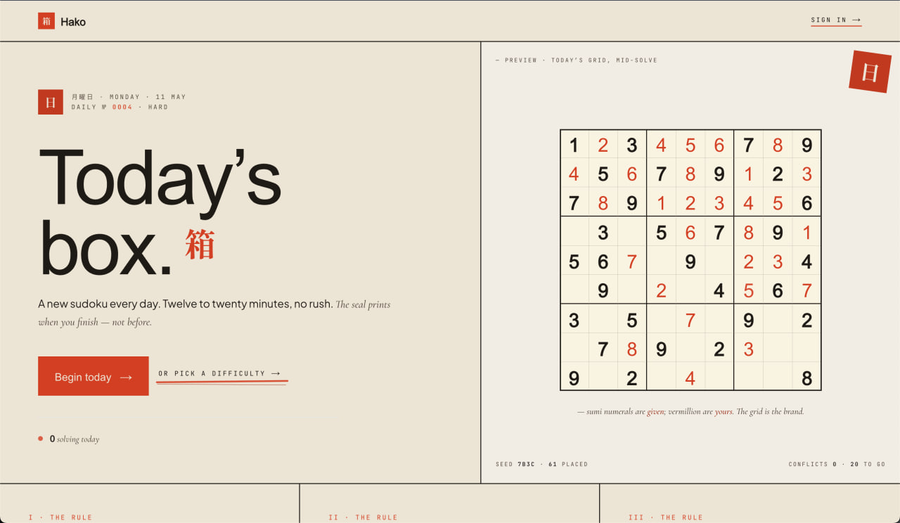

<div align="center">



**[ English ]** · **[ Русский ↓ ](#hako--箱--русская-версия)**

`Next.js 14` · `TypeScript` · `Supabase` · `Stripe` · `Gemini 2.5 Flash` · `Tailwind` · `Vitest`

`11.5k LOC` · `10 test suites` · `6 solving techniques` · `12 achievements` · `365 daily kanji`

</div>

---

> *"A new sudoku every day. Twelve to twenty minutes, no rush.*
> *The seal prints when you finish — not before."*

## The thirty‑second pitch

Hako (箱 — "box") is a daily sudoku that feels like a newspaper, not a casino. One puzzle a day, shared by everyone, unlocked at 00:00 in your timezone. When you finish, a vermillion **完** seal stamps off‑axis on the board and your time is *written, not flashed*.

The brief asked for an MVP. What's here is a full‑bodied take on **what daily sudoku could be if the design language did real work.**

|                  |                                                                                                  |
| :--------------- | :----------------------------------------------------------------------------------------------- |
| **What**         | a daily sudoku that feels like a newspaper, not a casino                                         |
| **For**          | the daily‑puzzle audience NYT Games and Wordle proved is real — sudoku is the conspicuous gap    |
| **Differentiator** | a coach that refuses to spoil · a streak you can actually lose · a year of kanji to fill in   |
| **Free**         | the daily, the coach (20 calls/day), the seasonal skin, the leaderboard                          |
| **Pro** ($4/mo)  | unlimited coach · Expert tier + full archive · every skin                                        |
| **Built with**   | Next.js 14 · Supabase · Stripe · Gemini 2.5 Flash · Tailwind · `@vercel/og`                      |

---

## Table of contents

1. [Why this exists](#why-this-exists)
2. [Why this could be a real service](#why-this-could-be-a-real-service)
3. [What sets Hako apart](#what-sets-hako-apart)
4. [The product surface](#the-product-surface)
5. [Engineering highlights](#engineering-highlights)
6. [Tech stack](#tech-stack)
7. [Run it locally](#run-it-locally)
8. [Project map](#project-map)
9. [Quality bar](#quality-bar)
10. [Roadmap](#roadmap)
11. [Русская версия ↓](#hako--箱--русская-версия)

---

## Why this exists

Most puzzle apps optimize for time‑on‑device. Hako optimizes for **the feeling of a finished day.**

- A streak you can lose — no grace pop‑up, miss a day and it resets.
- A coach that won't spoil it — Sensei has two modes; the cheaper one *can't* name the cell.
- A grid shared by the world — so rank means something.
- A reason to come back tomorrow — a new kanji, a one‑line reading, a square that fills.

The principle section on the landing names it directly: **静 Quiet · 日 Daily · 完 Finished.**

---

## Why this could be a real service

> *"Главная цель — не просто сделать сайт для игры, а показать, что вы можете создать продукт, который потенциально может стать настоящим сервисом."* — nFactorial

**The market is real.** NYT Games has built a multi‑million‑subscriber business around Mini Crossword, Wordle, and Connections — all *one puzzle, twelve minutes, shared, daily*. Sudoku at that polish is the conspicuous gap.

**Monetization is wired up.** Pro at $4/mo (Stripe subscription, live) targets the natural 3–8% who upgrade for unlimited coach + Expert + skins. One‑time skin SKUs (Sumi‑e at $1) are low‑friction emotional buys. Streak freezes (data model exists) are a Duolingo‑validated micro‑purchase.

**Retention is structural.** Four nested return triggers — daily ritual → streak → daily kanji + year scroll → achievements. Miss a day and you lose the streak, but the year scroll still fills, so the worst‑case lapsed user still has a partial record pulling them back.

**Acquisition is built into the win moment.** Every solved daily server‑renders an OG share card (kanji + time + streak baked into a 1080×1080 PNG). Each finished puzzle is a recruitment asset — no separate "share" feature needed.

**Unit economics work.** Gemini 2.5 Flash is ~$0.0003 per coach call. The 20‑call/day free quota caps a worst‑case free user at ~$0.18/month in AI cost. A single $4 Pro covers thousands of calls.

**The moat is the combination** — a single shared daily, a coach that refuses to spoil, a coherent design language. Each alone is hard; together they're a product personality.

---

## What sets Hako apart

Where Hako differs from a typical bootcamp sudoku submission:

- **It's a brand, not a feature list.** Mincho serif, vermillion seal, newspaper aesthetic. Most projects ship Material/shadcn applied to a grid — competent and forgettable. Design taste is the hardest thing to fake.
- **The coach is the actual novelty.** A two‑mode LLM hint system where `nudge` is prompt‑engineered to *genuinely refuse* to name the cell, even under pressure. Real prompt work, not "I called the API."
- **The product is a daily ritual, not a generator.** One global daily puzzle, a 365‑kanji year scroll with AI‑generated readings, streak + freeze mechanics, twelve achievements (four hidden). The retention loop is *structural*.
- **Real monetization, wired not promised.** Stripe subscription **and** one‑time SKUs, server‑side quota in Postgres, RLS policies, entitlement resolver. Most projects don't get past "this would be free."
- **Engineering rigor that doesn't render.** Generator verifier proves puzzle uniqueness in CI. Six classical solving techniques drive *graded* hints, not solver‑reveal. TypeScript strict, Vitest suites, RLS. Most projects skip these because they're invisible.

The moat isn't any one piece — it's that all five are coherent and ship together.

---

## The product surface

### Four difficulties · Easy 易 · Medium 中 · Hard 難 · Expert 極

38 → 22 givens. Daily is always Hard. Casual mode opens all four. Generator guarantees a unique solution ([`lib/sudoku/generator.ts`](lib/sudoku/generator.ts), [`unique.ts`](lib/sudoku/unique.ts)).

### Sensei · the coach

Two‑mode AI hint system on **Gemini 2.5 Flash** ([`lib/coach/`](lib/coach)).

| Mode  | Gives you                                                  | Never gives you       |
| ----- | ---------------------------------------------------------- | :-------------------- |
| nudge | the technique + the unit ("naked pair in row 6")           | the cell, the digit   |
| ask   | the cell + digit ("R6C8 is 7") + one sentence of reasoning | the rest of the solve |

Free: 20/day. Pro: unlimited. Quota tracked server‑side in Postgres.

### The seal calendar · 365 kanji a year

Each day has its own kanji (`月` moon, `火` fire, `水` water, `木` tree, `山` mountain…) plus a one‑sentence **Sensei reading** — Gemini‑generated with a locked prompt: *"8–14 words, present tense, reference kanji imagery, spare and grounded, no emoji or exclamations."*

The **Year Scroll** renders the full 365‑day grid in five states: filled · today · empty · freeze · future.

### Twelve marks · achievements

Kanji as badges, four hidden until earned. Streak (`連 月 百`), speed (`速 鋭 神`), special (`初 暁` + hidden marks).

### Pro · "three things, nothing else"

$4 / month: unlimited coach (`先`) · Expert + archive (`極`) · every skin (`完`).

### Skins · seasonal, premium, earned

Cosmetic palette swaps that also change the seal kanji and masthead copy.

- **Seasonal** — spring `桜`, summer `蓮`, autumn `楓`, winter `雪`. Free in‑season, archived for Pro.
- **Premium** — Sumi‑e `墨`, Indigo `藍`. One‑time SKU or included in Pro.
- **Challenge‑locked** — Matsuri `祭` (7‑day streak), Koi `鯉` (30 solves), Yūrei `幽` (solve at 3 a.m.).

### The shared ledger

Leaderboard filterable by date, city, range. City rank surfaced on home. OG share cards rendered on edge as 1080×1080 PNGs via `@vercel/og`.

---

## Engineering highlights

**1 · A solver that grades hints.** [`lib/sudoku/techniques.ts`](lib/sudoku/techniques.ts) implements six classical techniques in strict order of complexity: `naked-single → hidden-single → locked-candidate → naked-pair → hidden-pair → x-wing`. Each hint carries `{ index, value, technique, unit, cells, reason }` — the coach speaks like a teacher, not an answer key.

**2 · A coach prompt engineered to refuse.** The hard part of `nudge` isn't calling Gemini — it's a system prompt that holds the line under pressure. The prompt declares the technique and unit, forbids the cell and digit, and forbids partial reveals ("can't say, but it's R6C8"). See [`lib/coach/prompt.ts`](lib/coach/prompt.ts).

**3 · A generator with a verifier in CI.** `scripts/verify-generator.ts` (run via `npm run verify-generator`) batch‑generates puzzles and runs each through the solver to assert uniqueness. New seeds don't ship without passing.

**4 · A skin system that's data, not code.** Skins live in Postgres ([`lib/skins/registry.ts`](lib/skins/registry.ts)). A single resolver ([`catalog.ts`](lib/skins/catalog.ts)) maps `(skin, viewer, today) → action`. Adding a skin is a row insert, not a deploy.

---

## Tech stack

| Layer       | Choice                                                     |
| :---------- | :--------------------------------------------------------- |
| Framework   | Next.js 14 (App Router), React 18, TypeScript 5.7 (strict) |
| State       | Zustand                                                    |
| Styling     | Tailwind + CSS variables for skin palettes                 |
| Motion      | Framer Motion (sparingly)                                  |
| Auth + DB   | Supabase (Postgres + RLS)                                  |
| Payments    | Stripe (subscription + one‑time SKUs)                      |
| AI          | Google Gemini 2.5 Flash (`@google/genai`)                  |
| OG images   | `@vercel/og` (edge runtime, 1080×1080)                     |
| Testing     | Vitest + React Testing Library + jsdom                     |

---

## Run it locally

```bash
npm install
cp .env.example .env.local        # SUPABASE_* · STRIPE_* · GOOGLE_API_KEY
npm run dev                       # → http://localhost:3000
```

```bash
npm run typecheck                 # tsc --noEmit
npm run lint                      # next lint
npm test                          # vitest run
npm run verify-generator          # batch-check puzzle uniqueness
npm run seed                      # seed daily puzzles
npm run seed-seal                 # seed the year-of-kanji calendar
```

---

## Project map

```
app/        Next.js routes — api/ · play/[difficulty]/ · pro/ · leaderboard/ · year/
components/ game/ · landing/ · year-scroll/ · skins/ · stats/ · ui/
lib/
  sudoku/   generator · solver · 6 techniques · uniqueness checker
  coach/    Gemini prompts + per-user daily quotas
  seal/     calendar · streak · freeze · Sensei voice
  skins/    catalog · registry · entitlements · viewer resolution
  stripe/   checkout + webhooks
scripts/    seed + verify CLIs
tests/      vitest suites
supabase/   migrations
```

---

## Quality bar

- **TypeScript strict**, no `any` in the hint engine or coach quota logic
- **Vitest** suites cover skin entitlements, streak edges, calendar derivation, SFX caching
- **Generator verifier** gates non‑unique puzzles
- **RLS policies** in `supabase/migrations` — the client never trusts its own claim of identity
- **Coach quota** enforced server‑side in Postgres, not client‑rate‑limited

---

## Roadmap

- [ ] Mobile PWA install
- [ ] Push notification at 00:00 local when the daily unlocks
- [ ] Replay mode — step through your own solve afterward
- [ ] Two‑player race on the daily (same grid, side‑by‑side)
- [ ] Auto‑grant of challenge skins on the qualifying event
- [ ] Streak‑freeze purchase UI
- [ ] OG cards for streak milestones

---

<div align="center">

# Hako · 箱 · Русская версия

**тихая судоку, печатается ежедневно**

</div>

---

> *«Новая судоку каждый день. От двенадцати до двадцати минут, без спешки.*
> *Печать ставится, когда ты заканчиваешь — не раньше.»*

## Питч на тридцать секунд

Hako (箱 — «коробка», «ящик») — ежедневная судоку с ощущением газеты, а не казино. Одна задача в день, общая для всех, открывается в 00:00 локально. Когда ты заканчиваешь — киноварная печать **完** ставится с лёгким наклоном на доску, а время *записывается, а не вспыхивает*.

В техзадании просили MVP. Здесь — попытка ответить на вопрос **«какой могла бы быть ежедневная судоку, если бы дизайн действительно делал работу».**

|                  |                                                                                            |
| :--------------- | :----------------------------------------------------------------------------------------- |
| **Что**          | ежедневная судоку с ощущением газеты, а не казино                                          |
| **Для кого**     | аудитория ежедневных головоломок — та, которую сделали реальной NYT Games и Wordle         |
| **Отличие**      | подсказчик, который не сольёт · стрик, который можно реально потерять · год иероглифов     |
| **Бесплатно**    | дневная задача · подсказчик (20 раз/день) · сезонный скин · таблица лидеров                |
| **Pro** ($4/мес) | безлимитный подсказчик · уровень Expert + весь архив · все скины                           |
| **На чём**       | Next.js 14 · Supabase · Stripe · Gemini 2.5 Flash · Tailwind · `@vercel/og`                |

---

## Содержание

1. [Зачем это](#зачем-это)
2. [Почему это может стать настоящим сервисом](#почему-это-может-стать-настоящим-сервисом)
3. [Чем Hako отличается](#чем-hako-отличается)
4. [Продуктовая поверхность](#продуктовая-поверхность)
5. [Инженерные акценты](#инженерные-акценты)
6. [Стек](#стек)
7. [Запуск](#запуск)
8. [Карта проекта](#карта-проекта)
9. [Планка качества](#планка-качества)
10. [Дальше](#дальше)

---

## Зачем это

Большинство приложений‑головоломок оптимизируют время в приложении. Hako оптимизирует **ощущение завершённого дня.**

- Стрик, который можно потерять — никакого попапа‑спасения, пропустил день — обнулилось.
- Подсказчик, который не сольёт — у Sensei два режима; дешёвый *не может* назвать клетку.
- Сетка, общая для мира — поэтому ранг что‑то значит.
- Повод вернуться завтра — новый иероглиф, одна строка прочтения, клетка, которая заполняется.

Принципы на лендинге называют это прямо: **静 Тихо · 日 Каждый день · 完 Завершено.**

---

## Почему это может стать настоящим сервисом

> *«Главная цель — не просто сделать сайт для игры, а показать, что вы можете создать продукт, который потенциально может стать настоящим сервисом».* — nFactorial

**Рынок есть.** NYT Games построил многомиллионный подписочный бизнес вокруг Mini Crossword, Wordle, Connections — и все они работают по схеме *одна задача, двенадцать минут, общая, ежедневная*. Судоку такого уровня полировки — заметный пробел.

**Монетизация подключена.** Pro за $4/мес (Stripe‑подписка, работает) целит в естественные 3–8% бесплатных, которые апгрейдятся ради безлимитного подсказчика, Expert и скинов. Разовые SKU за скины (Sumi‑e за $1) — эмоциональные покупки без обязательств. Заморозки стрика (модель данных есть) — микро‑покупка, валидированная Duolingo.

**Удержание встроено в структуру.** Четыре вложенных триггера возврата — дневной ритуал → стрик → иероглиф дня + свиток года → ачивки. Пропустил день — стрик потерян, но свиток года продолжает заполняться, поэтому даже отвалившийся пользователь имеет частичную запись, тянущую обратно.

**Привлечение встроено в момент победы.** Каждая решённая дневная задача серверно рендерит OG‑карточку (иероглиф + время + стрик на 1080×1080 PNG). Каждая решённая задача работает как рекрутер — отдельная фича «поделиться» не нужна.

**Юнит‑экономика сходится.** Gemini 2.5 Flash стоит ~$0.0003 за вызов. Дневная квота в 20 вызовов ограничивает худший случай бесплатного пользователя ~$0.18/мес в стоимости AI. Pro за $4 покрывает тысячи вызовов.

**Защита — в комбинации**: одна общая дневная задача, подсказчик, который реально отказывается сливать, цельный дизайн‑язык. Каждая часть по отдельности — сложно; вместе — продуктовая личность.

---

## Чем Hako отличается

Где Hako отличается от типичной буткемп‑судоку:

- **Это бренд, а не список фич.** Шрифт Mincho, киноварная печать, газетная эстетика. Большинство проектов выкатывают Material/shadcn, наложенный на сетку — компетентно и забываемо. Дизайн‑вкус — самое сложное, что нельзя сымитировать.
- **Подсказчик — это и есть новизна.** Двухрежимный LLM‑подсказчик, где `nudge` через инженерию промпта *реально отказывается* назвать клетку, даже под давлением. Настоящая работа с промптом, а не «я вызвал API».
- **Продукт — это ритуал, а не генератор.** Одна глобальная дневная задача, свиток года из 365 иероглифов с AI‑прочтениями, стрик + заморозка, двенадцать ачивок (четыре скрыты). Петля удержания — *структурная*.
- **Настоящая монетизация, подключена.** Stripe‑подписка **и** разовые SKU, серверная квота в Postgres, RLS‑политики, резолвер прав. Большинство проектов не идут дальше «было бы бесплатно».
- **Инженерная строгость, которая не рендерится.** Верификатор генератора в CI проверяет единственность. Шесть классических техник дают *градуированные* подсказки, а не «открой клетку». Strict TypeScript, Vitest, RLS. Большинство проектов это пропускает, потому что не видно глазу.

Защита — не в одном куске, а в том, что все пять связно работают вместе.

---

## Продуктовая поверхность

### Четыре уровня · Easy 易 · Medium 中 · Hard 難 · Expert 極

38 → 22 открытых клетки. Дневная задача всегда Hard. Casual открывает все четыре. Генератор гарантирует единственное решение ([`lib/sudoku/generator.ts`](lib/sudoku/generator.ts), [`unique.ts`](lib/sudoku/unique.ts)).

### Sensei · подсказчик

Двухрежимный AI‑подсказчик на **Gemini 2.5 Flash** ([`lib/coach/`](lib/coach)).

| Режим | Что говорит                                                  | Что не говорит никогда |
| ----- | ------------------------------------------------------------ | :--------------------- |
| nudge | технику и юнит («naked pair в строке 6»)                     | клетку, цифру          |
| ask   | клетку и цифру («R6C8 = 7») + одно предложение объяснения    | остальной путь решения |

Бесплатно: 20/день. Pro: без ограничений. Квота считается на сервере в Postgres.

### Календарь печатей · 365 иероглифов в год

У каждого дня свой иероглиф (`月` луна, `火` огонь, `水` вода, `木` дерево, `山` гора…), плюс одно предложение от **Сэнсэя** — сгенерировано Gemini с зафиксированным промптом: *«8–14 слов, настоящее время, отсылка к образу иероглифа, скупо и приземлённо, без эмодзи и восклицаний».*

**Свиток года** рендерит всю 365‑дневную сетку в пяти состояниях: заполнено · сегодня · пусто · заморозка · будущее.

### Двенадцать знаков · ачивки

Иероглифы вместо иконок, четыре скрыты до получения. Стрик (`連 月 百`), скорость (`速 鋭 神`), особые (`初 暁` + скрытые).

### Pro · «три вещи, ничего больше»

$4 / мес: безлимитный подсказчик (`先`) · Expert + архив (`極`) · все скины (`完`).

### Скины · сезонные, премиум, заработанные

Косметические темы, которые меняют иероглиф печати и текст шапки.

- **Сезонные** — весна `桜`, лето `蓮`, осень `楓`, зима `雪`. Бесплатны в свой сезон, в архиве — для Pro.
- **Премиум** — Sumi‑e `墨`, Indigo `藍`. Разовая покупка или включены в Pro.
- **Challenge‑locked** — Matsuri `祭` (стрик 7 дней), Koi `鯉` (30 решений), Yūrei `幽` (решить в 3 утра).

### Общая летопись

Таблица лидеров с фильтрами по дате, городу, диапазону. Городской ранг показывается на главной. OG‑карточки рендерятся на edge как 1080×1080 PNG через `@vercel/og`.

---

## Инженерные акценты

**1 · Решатель, который ранжирует подсказки.** [`lib/sudoku/techniques.ts`](lib/sudoku/techniques.ts) реализует шесть классических техник в строгом порядке сложности: `naked-single → hidden-single → locked-candidate → naked-pair → hidden-pair → x-wing`. Каждая подсказка несёт `{ index, value, technique, unit, cells, reason }` — подсказчик говорит как учитель, а не как ответник.

**2 · Промпт подсказчика, который умеет отказывать.** Сложность `nudge`‑режима не в вызове Gemini, а в системном промпте, который держит строй под давлением. Промпт явно называет технику и юнит, запрещает конкретную клетку и цифру, запрещает обходные конструкции вроде «не скажу, но это R6C8». См. [`lib/coach/prompt.ts`](lib/coach/prompt.ts).

**3 · Генератор с верификатором в CI.** `scripts/verify-generator.ts` (`npm run verify-generator`) пакетно генерирует задачи и прогоняет каждую через решатель для проверки единственности. Новые сиды без этого не уходят.

**4 · Скины — данные, а не код.** Скины лежат в Postgres ([`lib/skins/registry.ts`](lib/skins/registry.ts)). Единый резолвер ([`catalog.ts`](lib/skins/catalog.ts)) переводит `(скин, зритель, дата) → действие`. Добавить скин — вставить строку, а не выкатить релиз.

---

## Стек

| Слой         | Выбор                                                      |
| :----------- | :--------------------------------------------------------- |
| Каркас       | Next.js 14 (App Router), React 18, TypeScript 5.7 (strict) |
| Стейт        | Zustand                                                    |
| Стилизация   | Tailwind + CSS‑переменные для палитр скинов                |
| Анимация     | Framer Motion (скупо)                                      |
| Auth + БД    | Supabase (Postgres + RLS)                                  |
| Платежи      | Stripe (подписка + разовые SKU)                            |
| AI           | Google Gemini 2.5 Flash (`@google/genai`)                  |
| OG‑картинки  | `@vercel/og` (edge runtime, 1080×1080)                     |
| Тесты        | Vitest + React Testing Library + jsdom                     |

---

## Запуск

```bash
npm install
cp .env.example .env.local        # SUPABASE_* · STRIPE_* · GOOGLE_API_KEY
npm run dev                       # → http://localhost:3000
```

```bash
npm run typecheck                 # tsc --noEmit
npm run lint                      # next lint
npm test                          # vitest run
npm run verify-generator          # пакетная проверка единственности
npm run seed                      # сидинг дневных задач
npm run seed-seal                 # сидинг годового календаря
```

---

## Карта проекта

```
app/        маршруты Next.js — api/ · play/[difficulty]/ · pro/ · leaderboard/ · year/
components/ game/ · landing/ · year-scroll/ · skins/ · stats/ · ui/
lib/
  sudoku/   генератор · решатель · 6 техник · единственность
  coach/    промпты Gemini + дневные квоты
  seal/     календарь · стрик · заморозка · голос Сэнсэя
  skins/    каталог · реестр · права · viewer
  stripe/   checkout + вебхуки
scripts/    seed + проверки
tests/      тесты vitest
supabase/   миграции
```

---

## Планка качества

- **TypeScript strict**, без `any` в подсказчике и квотах
- **Vitest** покрывает права на скины, границы стрика, состояние календаря, кэш SFX
- **Верификатор генератора** — ворота против неуникальных задач
- **RLS‑политики** в `supabase/migrations` — клиент не верит собственному заявлению о личности
- **Квота подсказчика** считается на сервере в Postgres

---

## Дальше

- [ ] Мобильный PWA‑install
- [ ] Push‑уведомление в 00:00 локально, когда открывается дневная
- [ ] Replay‑режим — пройти своё решение пошагово
- [ ] «Двое против одной задачи» — общий грид, бок о бок
- [ ] Авто‑выдача challenge‑скинов по событию
- [ ] UI покупки заморозки стрика
- [ ] OG‑карточки для майлстоунов стрика

---

<div align="center">

— *open the box · 箱を開けて* —

<sub>Hako · v1.0</sub>

</div>
